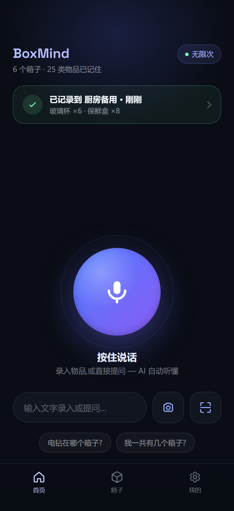
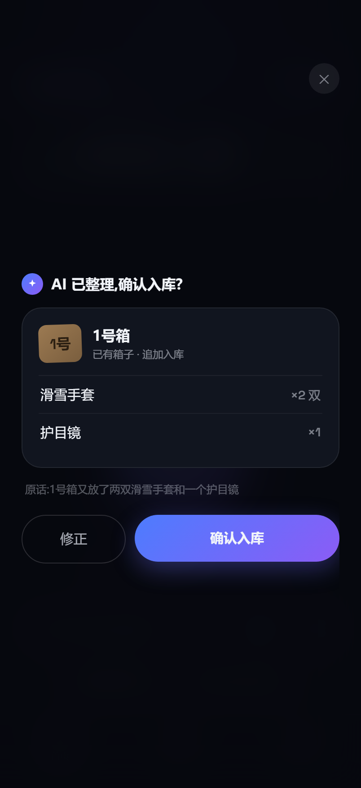
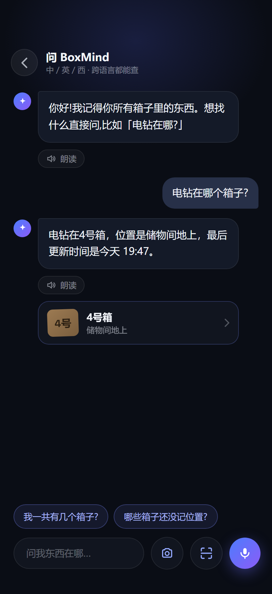
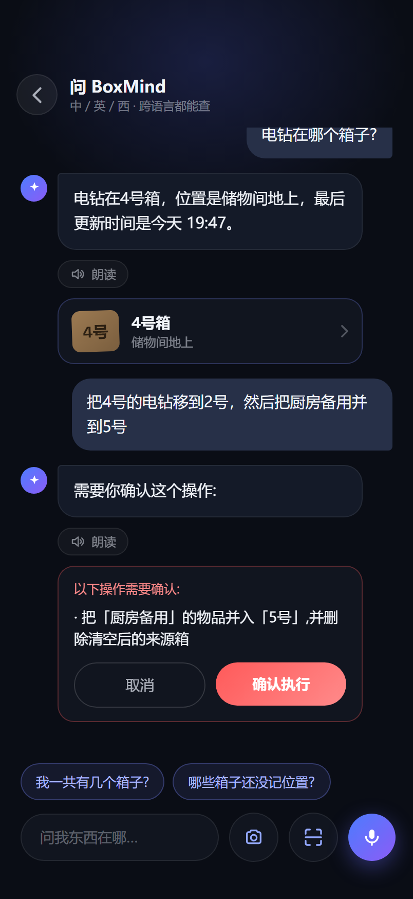
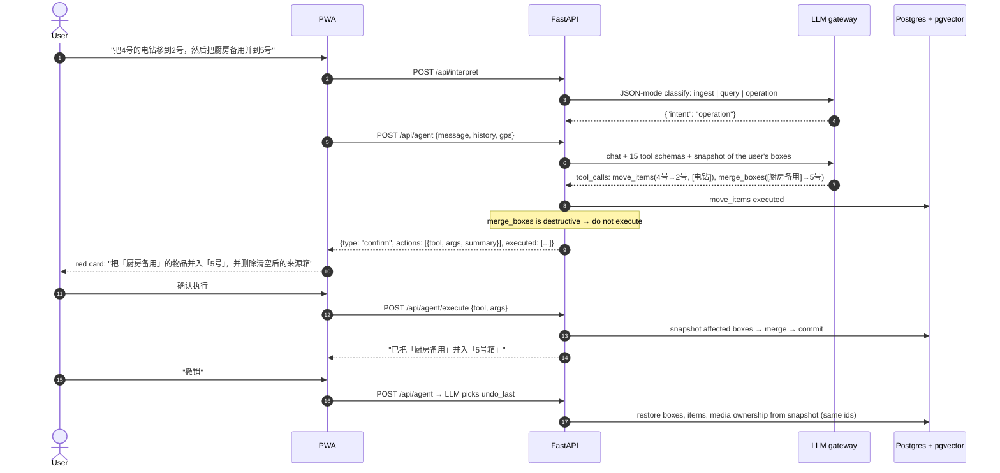
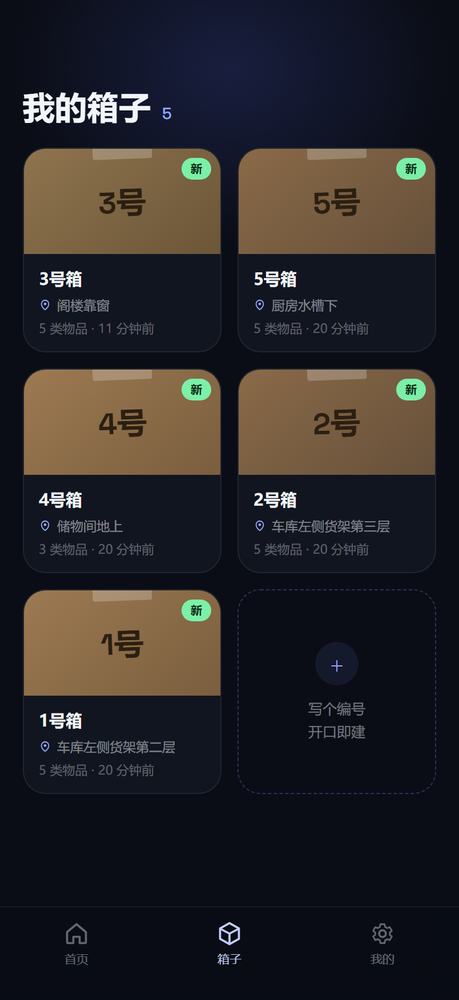
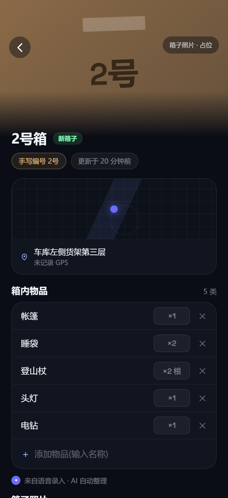
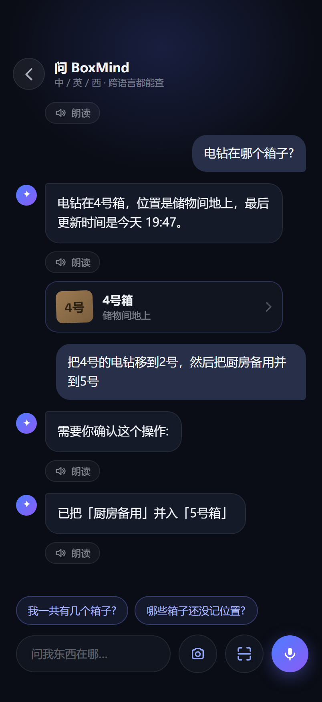
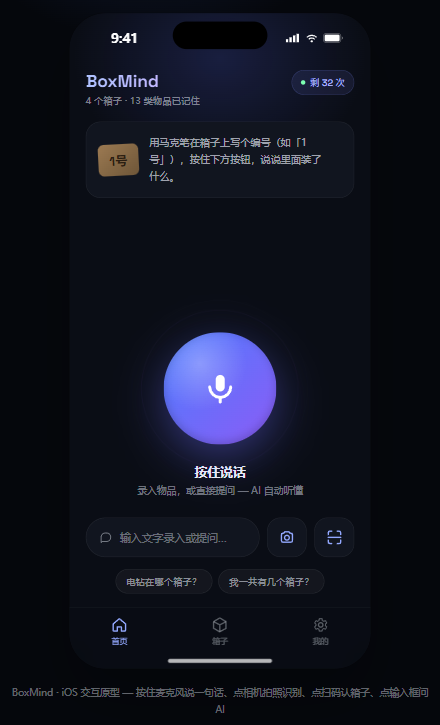

# BoxMind

**Scan a box, say a word, and let an AI remember everything.**

[](https://github.com/lizhe666666666/BoxMind/actions/workflows/ci.yml)
[](LICENSE)


BoxMind is an AI inventory assistant for the boxes people pack into garages, storage units and closets. You tell it what went into a box by voice, text, photo or barcode. Later you ask "where is the tent?" in plain language and it answers. Housekeeping ("move the headlamps from box 5 to box 7", "merge the two kitchen boxes") is done by an **LLM function-calling agent that operates the app's own API**, with a confirmation step before anything destructive and single-step undo.

The interesting part is not that an LLM was used to write code. It is that the LLM is the runtime: a small classifier routes each sentence, an agent decides which backend operations to call and in what order, a vision model reads photos into structured items, and a RAG loop answers questions. Everything the models do is bounded by tool schemas, confirmation gates and tests.

Built solo in June 2026 as an MVP. The UI is Chinese-first; code comments are partly Chinese; this README and the docs are English.

<p align="center">
  
  
  
  
</p>

## What it does

| Capability | How |
|---|---|
| Natural-language operations | Function-calling agent with 15 tools (search, create, add, rename, move, set location / GPS / barcode, delete, empty, merge, undo). Destructive tools pause and return a confirmation card; the app snapshots affected boxes before executing so "undo" restores them. |
| Structured intake | One sentence → box label, items with quantities, location. Shown as a confirm card, never written silently. If no box was named, the app asks which one and suggests the next free number. |
| Question answering | RAG: items are embedded locally (multilingual MiniLM, 384-d) into Postgres/pgvector; the answer streams back over SSE and the boxes it mentions become tappable cards. Cross-lingual ("snow boots" finds 雪地靴). |
| Photo intake | A vision model reads a photo of an open box and returns items with a confidence level plus the handwritten label if visible; low-confidence items start unchecked. |
| Barcode / QR | In-browser decoding (ZXing) links a physical code to a box; a handwritten label is the fallback. |
| Voice | Browser Web Speech (on-device, real time) first, server-side ASR through the gateway second, typing last. Audio is kept so the note can be replayed. |
| Read-aloud | TTS on any answer. |
| Media | Photos become box covers; photos and voice notes are stored per box. |
| Login | Email verification code (SMTP), with a dev mode that returns the code from the API so the app runs without mail setup. |

## How one sentence is handled



The trace above is the real one behind the screenshots. Three things worth noticing:

- **The classifier is a router, not the brain.** One cheap JSON-mode call decides between the fixed intake UI (`ingest`), streaming RAG (`query`) and the agent (`operation`). Intake is the most frequent action and benefits from a deterministic confirm card; the agent handles the long tail without new code per intent.
- **The model proposes, the user disposes.** `delete_item`, `delete_box`, `empty_box` and `merge_boxes` are declared to the model like any other tool, but the loop never executes them. It returns a human-readable summary; only an explicit second request runs the action, after a snapshot is taken. Non-destructive calls in the same turn (the move, here) run immediately instead of being dropped.
- **References and arithmetic are resolved with context, then validated.** The system prompt embeds a compact snapshot of the user's boxes, so "7号", "Liam" or "the kitchen box" resolve and "add three more" becomes a final count in the tool call. Every tool re-validates against the database and returns an error object the model can react to, including a missing-argument error when the model sends malformed JSON.

Full decision log, including the move from a two-intent classifier to the agent: [docs/DEVELOPMENT.md](docs/DEVELOPMENT.md).

## Architecture

```
React 19 PWA (Vite, zustand, ZXing)
        │  HTTPS, same origin
FastAPI backend ─────────── any OpenAI-compatible gateway
   ├─ /api/interpret   JSON-mode intent router (ingest | query | operation)
   ├─ /api/agent       function-calling loop, ≤6 steps, confirm-before-destroy
   ├─ /api/agent/execute   runs one confirmed destructive action (snapshot first)
   ├─ /api/ask         streaming RAG (SSE)
   ├─ /api/recognize   vision intake
   ├─ /api/transcribe  /api/tts
   ├─ /api/boxes       CRUD, resolve-by-code, media upload
   ├─ /api/me          profile, settings, JSON/CSV export
   └─ /media           static photos / audio
PostgreSQL 17 + pgvector (Docker)
```

In production the backend serves the built frontend, so one process behind one HTTPS endpoint carries the app, the API and user media. Embeddings run in-process with fastembed by default; the gateway is used for chat, tools, vision, ASR and TTS, all through the OpenAI-compatible surface, so swapping the model or provider is a `.env` change.

<p align="center">
  
  
  
</p>

## Tests

Tests were written to make the AI orchestration checkable without a model in the loop.

| Suite | Count | What is real, what is faked |
|---|---|---|
| Backend `pytest` | 148 | Real PostgreSQL + pgvector (throwaway `boxmind_test` database, created on demand), real FastAPI app through `TestClient`, real cascades and undo snapshots. Faked: embeddings (deterministic hash vectors, so nothing is downloaded and exact names always match) and the LLM gateway (a scripted client that replays tool calls and records every request). Warnings are errors. |
| Frontend `vitest` | 39 | Store logic (routing of a sentence, confirm-card flow, photo-intake selection, scan fallback, display helpers) with the API module mocked; API client (auth header, 401 → logout, SSE parser across arbitrary chunk boundaries). |

The agent loop is tested turn by turn: which tools were called, what was fed back to the model, when the loop paused for confirmation, what happens on malformed arguments, that non-destructive siblings of a destructive call still run, and that the six-step cap holds. Undo is tested to restore boxes with the same ids, items re-embedded and media rows moved back.

```bash
# backend (needs the docker compose database; creates boxmind_test itself)
cd backend && pip install -r requirements-dev.txt && ruff check app tests && pytest

# frontend
cd frontend && npm ci && npm run lint && npm test && npm run build
```

CI runs both on every push: [.github/workflows/ci.yml](.github/workflows/ci.yml).

## Run locally

```bash
# 1. database (pgvector on host port 5434)
docker compose up -d

# 2. backend
cd backend
python -m venv .venv && . .venv/Scripts/activate   # or: source .venv/bin/activate
pip install -r requirements.txt
cp .env.example .env    # set BOXMIND_LLM_API_KEY at minimum
uvicorn app.main:app --port 8001

# 3. frontend
cd ../frontend
npm install
npm run dev             # http://localhost:5173, /api proxied to :8001
```

Logging in without SMTP: leave `BOXMIND_SMTP_HOST` empty and the code request returns the code in the response (the login screen shows it). The first backend start downloads the embedding model (about 500 MB) once.

For production, `npm run build` and start the backend; it serves `frontend/dist` itself.

## Configuration

All settings are environment variables prefixed `BOXMIND_`, documented in [backend/.env.example](backend/.env.example). Model names (`LLM_MODEL`, `VISION_MODEL`, `ASR_MODEL`, `TTS_MODEL`, `EMBEDDING_MODEL`) are configuration, not code. The default gateway is [getbot.me](https://api.getbot.me), an OpenAI-compatible gateway I also run; any compatible endpoint works.

Things to know before exposing an instance:

- `BOXMIND_JWT_SECRET` has a development default. Set it.
- Dev-mode login (empty SMTP host) returns verification codes from the API. Configure SMTP for anything reachable by others.
- CORS allows localhost and private-network origins only; the intended deployment serves frontend and API from the same origin.
- Secrets, TLS certificates and user media are git-ignored.

## Repository layout

```
backend/
  app/
    routers/        HTTP surface, one file per concern
    services/
      agent.py            function-calling loop
      agent_tools.py      tool schemas + executors (read / add / modify)
      agent_destructive.py  summaries, snapshot, execute, undo
      llm.py              prompts and the OpenAI-compatible client
      embeddings.py       local fastembed or remote /embeddings
    normalize.py    "1号" = "Box 1" = "一号" label normalisation
  tests/            pytest suite (see above)
frontend/
  src/
    store.ts        zustand state machine for intake / ask / agent / camera / scan
    api.ts          API client + SSE parser
    screens/        Home, Ask, Boxes, BoxDetail, Camera, Scan, Settings, Login, Onboarding
  tests/            vitest suite
docs/
  DEVELOPMENT.md    decision log and iteration history
  design/           PRD v1.0 and the high-fidelity HTML prototype the app was built from
  screenshots/
```

<p align="center">
  <br>
  <sub>The pre-implementation prototype, kept in <a href="docs/design">docs/design</a> with a note on where the implementation deviates.</sub>
</p>

## Stack

Python 3.11, FastAPI, SQLAlchemy 2, pgvector, fastembed, PyJWT · React 19, TypeScript, Vite, zustand, vite-plugin-pwa, @zxing/browser · PostgreSQL 17 with pgvector (Docker) · any OpenAI-compatible gateway for chat, tools, vision, ASR and TTS.

About 6K lines of application code plus 2K lines of tests.

## Status and limits

- MVP: one user per account, no sharing.
- Undo is single-step. Undoing a box deletion restores items but not photos (media rows cascade); undoing a merge restores photos too.
- Server-side ASR depends on the gateway exposing the model; the browser engine is the default and works on Chromium and Safari.
- Photo recognition quality is bounded by the vision model and the photo.
- PWA only, no native app.

## License

[MIT](LICENSE)
